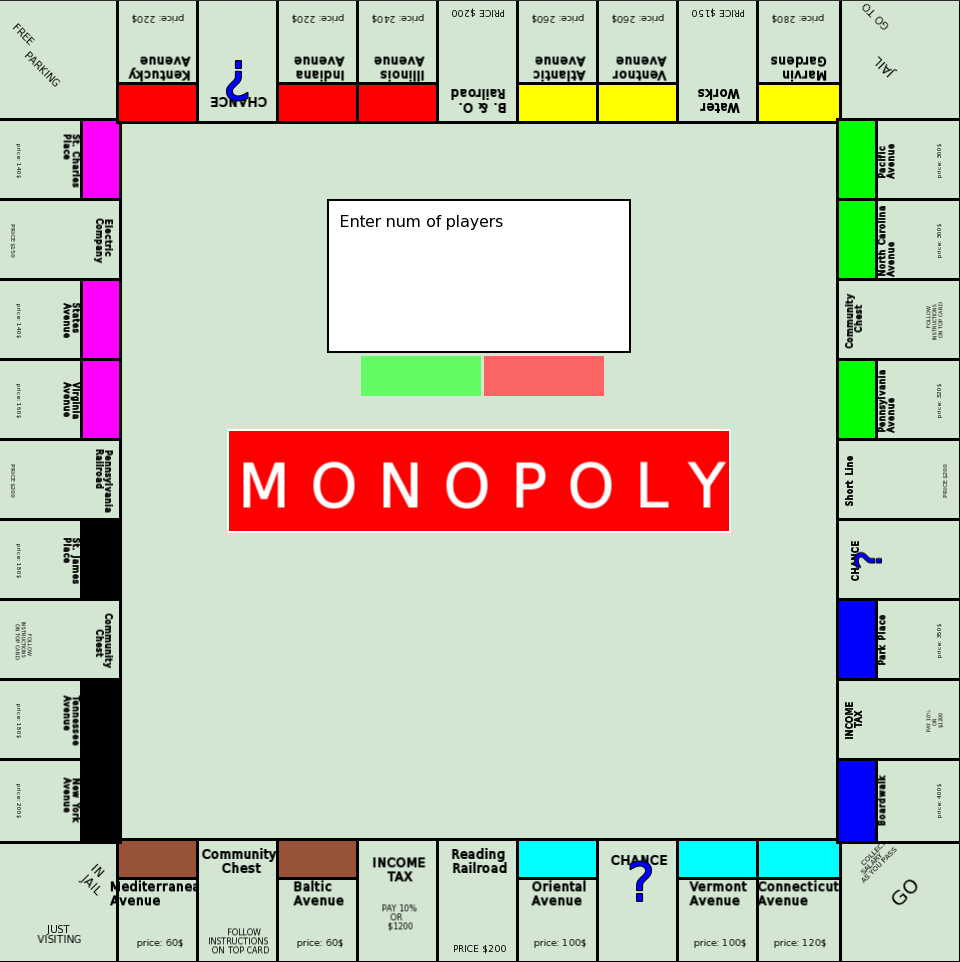
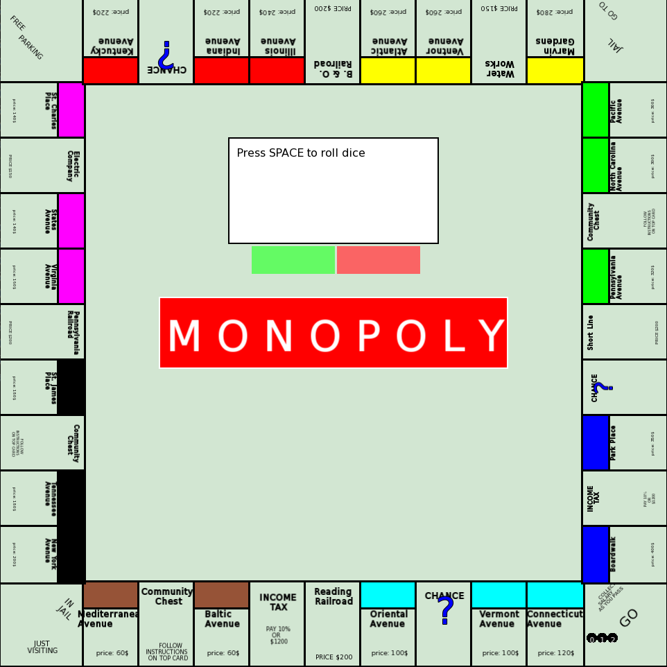
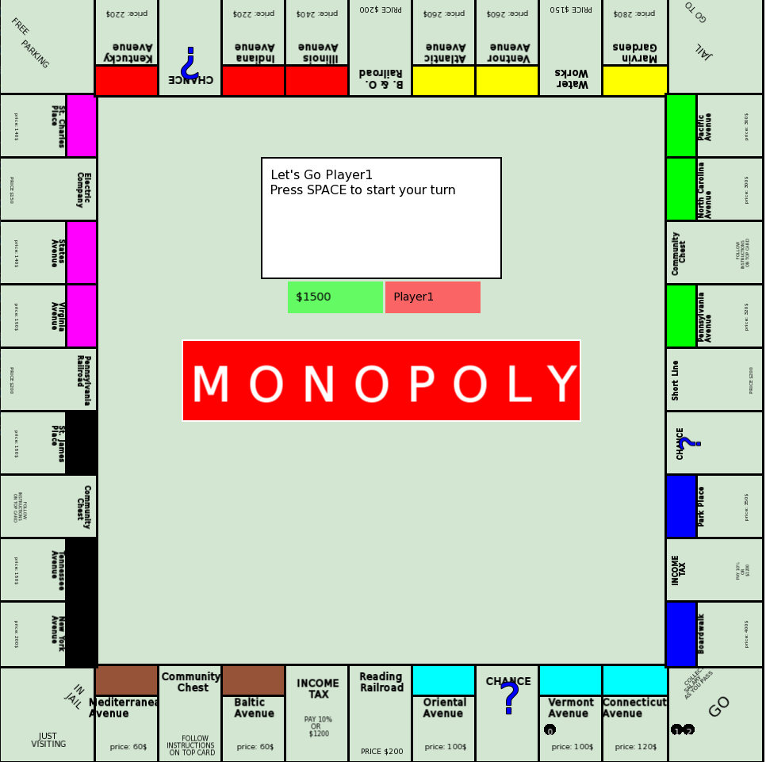

# Monopoly Game Implementation

A C++ implementation of the classic Monopoly board game using SFML for graphics.

## Architecture

The game follows the Cocoa Model-View-Controller (MVC) architectural pattern as seen in Cocoa documentation:


## Features

- Complete Monopoly game rules implementation
- Property management system
- Rent calculation based on property type
- Dice rolling mechanics with doubles rules
- Player turn management
- Bankruptcy handling
- Support for 2-8 players

## Game Screenshots

### Game Start

The initial screen where players can enter the number of participants (2-8 players).

### Player Turn

Shows the current player's turn with their balance and available actions.

### Dice Rolling

Players can roll dice by pressing SPACE, determining their movement on the board.

## Technical Details

### Core Components

- `GameModel`: Handles game logic and state
- `GameView`: Manages SFML rendering and UI
- `GameController`: Coordinates between Model and View
- `Board`: Manages game board and squares
- `Player`: Handles player state and actions

### Building Requirements
- Ubuntu-based Linux (works on Mint 20)
- C++17 or higher
- SFML 2.5.1+
## Get SFML Here:

### Build Instructions

```bash
git clone https://github.com/iMRUM/cpponopoly && cd cpponopoly && g++ -std=c++20 main.cpp src/view/components/*.cpp src/controller/*.cpp src/model/*.cpp src/view/*.cpp src/controller/states/*.cpp -o monopoly -lsfml-graphics -lsfml-window -lsfml-system

```
### Run
```bash
./monopoly
```
### Code Structure

```
src/
├── model/
│   ├── GameModel.cpp
│   ├── Board.cpp
│   └── Player.cpp
├── view/
│   ├── GameView.cpp
│   └── BoardView.cpp
└── controller/
    └── GameController.cpp
```

## Contributing

1. Fork the repository
2. Create a feature branch
3. Submit a pull request

## License

This project is licensed under the MIT License - see the LICENSE file for details.
